# ANDAI Platform User Manual

Step-by-step training guide for normal users, organization admins, and full admins

- Version 4.0
- Prepared on: July 14, 2026
- Audience: ANDAI platform users and administrators

## Contents

- 1. Purpose and Scope
- 2. Roles and Access
- 3. Sign In and Navigate
- 4. Normal User - Ask ANDAI
- 5. Organization Admin - Overview
- 6. Organization Admin - Documents and FAQ
- 7. Organization Admin - Database
- 8. Organization Admin - Evaluations and Analytics
- 9. Organization Admin - Users and Audit Logs
- 10. Full Admin - Platform Setup
- 11. Troubleshooting
- 12. Suggested Training Session
- Appendix A. API Testing for Technical Users

## 1. Purpose and Scope

This manual teaches Full Admins, Organization Admins, and Normal Users how to use ANDAI. Follow only the section for your role; ANDAI hides pages that your account is not allowed to use.

**How ANDAI protects knowledge:** Your role controls the pages you can open. Your organization and department access control which documents, FAQ items, database tables, and chat evidence you can use.

### What this manual covers

- Signing in and finding the pages available to you.
- Asking questions and checking the evidence used in an answer.
- Uploading and maintaining approved organization knowledge.
- Creating organizations, departments, and users.
- Testing answer quality, reviewing usage, and checking audit logs.
- Using the authenticated chat API for authorized technical testing.

## 2. Roles and Access

| Role | Pages shown | Main responsibility | Limits |
| --- | --- | --- | --- |
| Normal User | Assistant | Ask questions and verify answers. | Cannot upload knowledge or manage accounts. |
| Organization Admin | Overview, Assistant, Documents, FAQ, Database, Evaluations, Analytics, Users, Audit Logs | Maintain one organization's knowledge and users. | Limited to the assigned organization and departments. |
| Full Admin / Super Admin | Overview, Organizations, Users, Audit Logs | Set up and oversee the platform. | Daily knowledge maintenance belongs to Organization Admins. |

**Department access:** A user without a department can still open Assistant and chat. However, private organization knowledge may return no evidence until an admin assigns a department. New organizations receive a General department by default.

## 3. Sign In and Navigate

### Sign in

1. Open https://andai.my or the address supplied by your administrator.
2. Enter the email address and temporary password supplied to you.
3. Click Sign in.
4. Confirm that the name and role shown at the bottom of the sidebar are correct.

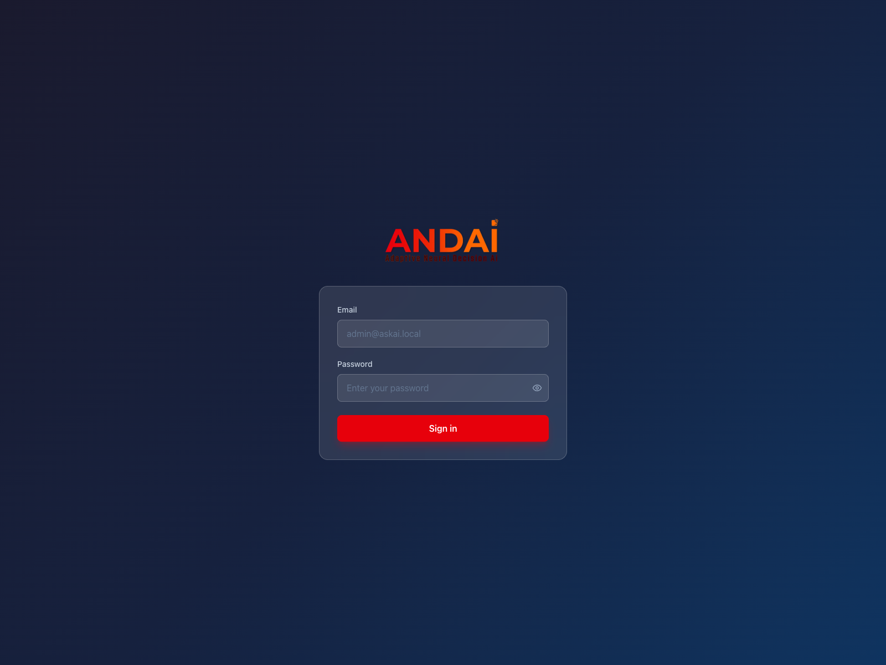

*Screenshot 1: ANDAI sign-in page.*

### Main screen areas

- Sidebar: opens the pages allowed for your role.
- Main area: shows the page you selected.
- Account area: shows your name, email, role, and Sign out.
- Organization selector: shown only when your role can work across organizations.

**A missing page is usually not an error:** ANDAI deliberately hides pages that do not belong to your role. Ask an administrator to check your role if you believe access is missing.

## 4. Normal User - Ask ANDAI

### Start a conversation

1. Open Assistant.
2. Click New Chat when you want to start a separate topic.
3. Keep Database, PDF / Docs, and FAQ selected unless you want to search fewer sources.
4. Type one clear question in the message box.
5. Click the send button and wait for the answer.
6. Open an earlier conversation from the list on the left when you need to continue it.

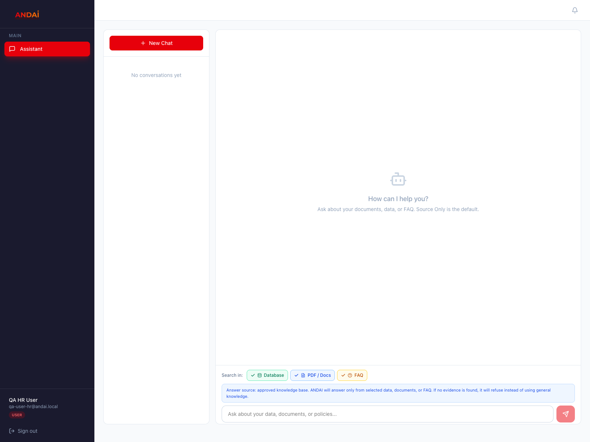

*Screenshot 2: Normal User view. Only Assistant and chat history are available.*

| Source | Use it for | Example |
| --- | --- | --- |
| Database | Numbers, lists, and facts from imported tables. | How many applications were approved this month? |
| PDF / Docs | Policies, manuals, procedures, and Word documents. | What documents are required for this application? |
| FAQ | Short, approved answers to common questions. | Who should I contact for account support? |

### Check every answer

- Read the answer and the source badges or citations shown with it.
- If ANDAI says it cannot find evidence, make the question more specific or ask an admin to add the missing knowledge.
- Do not treat an answer as policy when no source is shown.
- Start a new chat when changing to an unrelated topic.

## 5. Organization Admin - Overview

Organization Admins maintain the knowledge used by people in their organization. The account may be shown as ADMIN in the sidebar. Select the correct department before creating or uploading content.

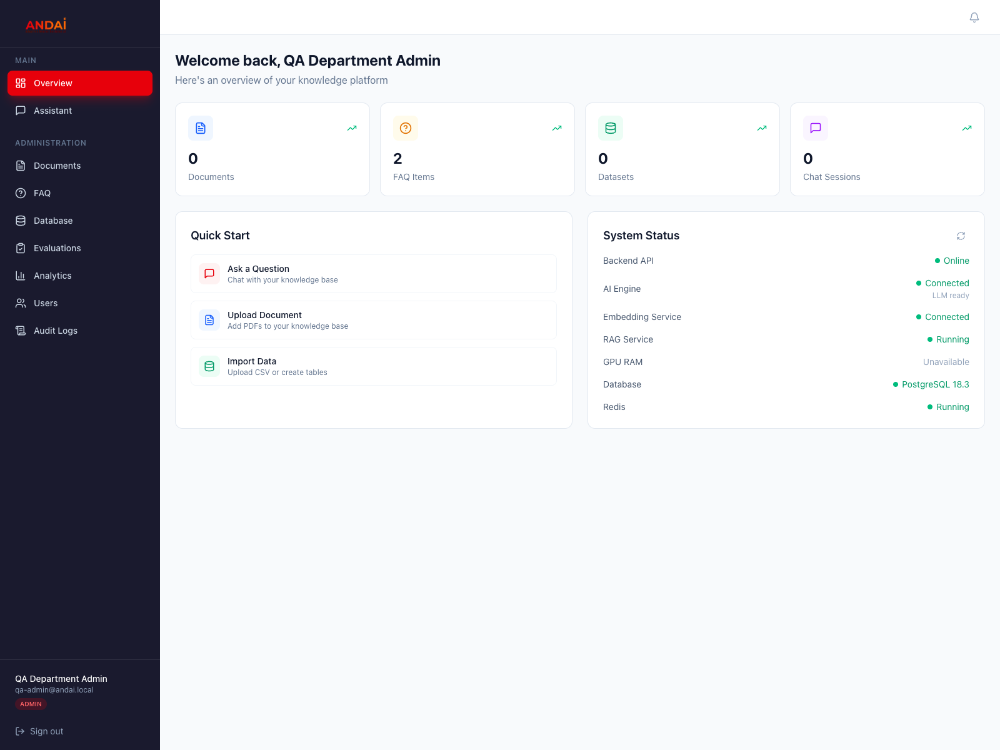

*Screenshot 3: Organization Admin overview and administration navigation.*

| Page | Purpose |
| --- | --- |
| Overview | Check knowledge counts, quick actions, and service status. |
| Assistant | Test the same question experience used by normal users. |
| Documents | Upload PDF and Word documents. |
| FAQ | Create approved question-and-answer entries. |
| Database | Create tables and import CSV or SQL data. |
| Evaluations | Run repeatable answer-quality tests. |
| Analytics | Review usage and unanswered questions. |
| Users | Manage users and department access in the organization. |
| Audit Logs | Review important actions in the organization. |

## 6. Organization Admin - Documents and FAQ

### Upload a document

1. Open Documents.
2. Select the department that owns the document.
3. Click Upload Document and choose a readable PDF or Word .docx file.
4. Wait until the status becomes Ready before testing questions.
5. If processing fails, use Retry processing or upload a text-readable version.

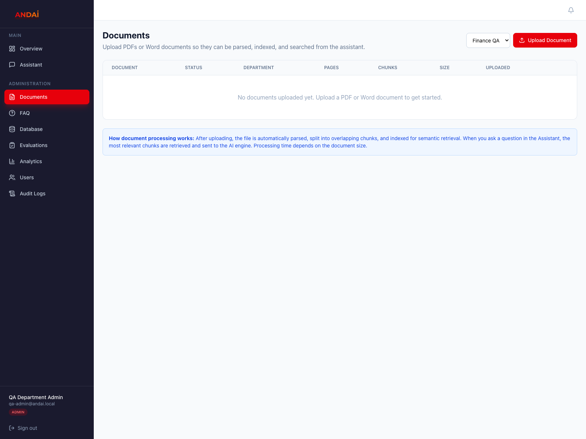

*Screenshot 4: Organization Admin Documents page.*

### Create an FAQ item

1. Open FAQ and select the correct department.
2. Click Add FAQ.
3. Enter the question in the words users normally use.
4. Enter the short, approved answer.
5. Publish and save the item when it is ready for users.

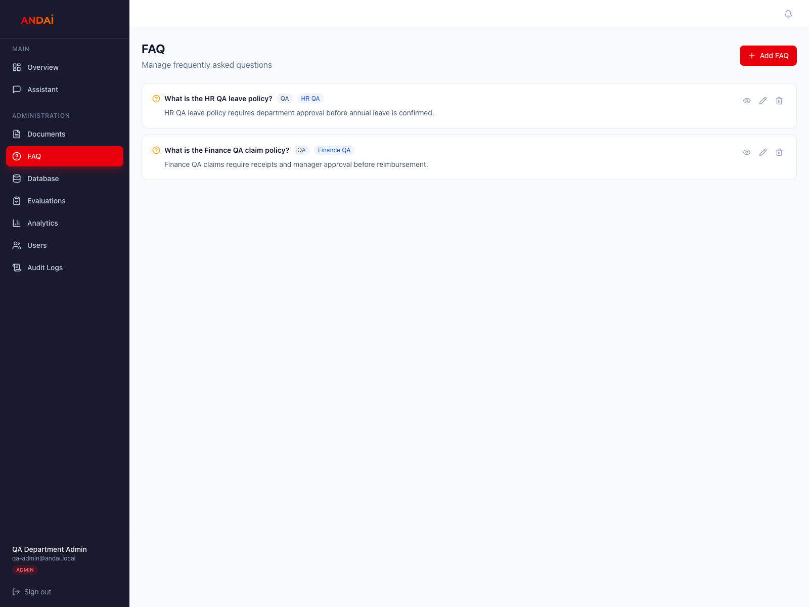

*Screenshot 5: Organization Admin FAQ page.*

**Knowledge quality:** Use final approved files, clear filenames, and short FAQ answers. Remove or unpublish outdated information when a policy changes.

## 7. Organization Admin - Database

### Available database actions

- Tables: review imported tables and open their rows.
- Create Table: define a small table and its columns manually.
- Upload Table & Data: create a table from a CSV or SQL file.
- Upload Data: append to or replace rows in an existing table.

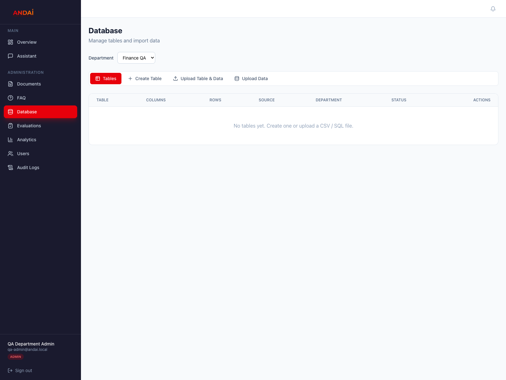

*Screenshot 6: Database page with table-management actions.*

### Upload a new table

1. Open Database and select the owning department.
2. Click Upload Table & Data.
3. Enter a clear display name and optional description.
4. Choose a CSV or SQL file.
5. Review the preview when shown, then click Create & Import.
6. Return to Tables and use View data to confirm the imported rows.

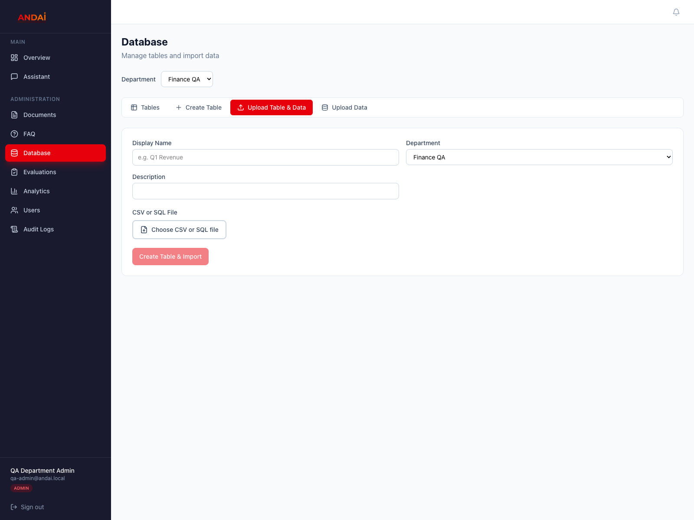

*Screenshot 7: Upload Table & Data form.*

## 8. Organization Admin - Evaluations and Analytics

### Test answer quality

1. Open Evaluations.
2. Add a representative question.
3. Enter expected keywords and an expected source when useful.
4. Run the test and review whether it passed, its answer, sources, and response time.
5. Improve the underlying document, FAQ, or table when the answer is weak.

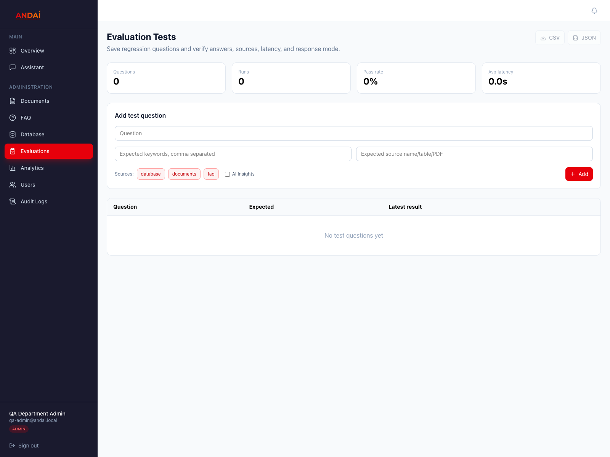

*Screenshot 8: Evaluation Tests page.*

### Use analytics to improve knowledge

- Review chat volume and active users.
- Check which sources are being used.
- Review common and unanswered questions.
- Add or improve knowledge for questions users cannot answer.

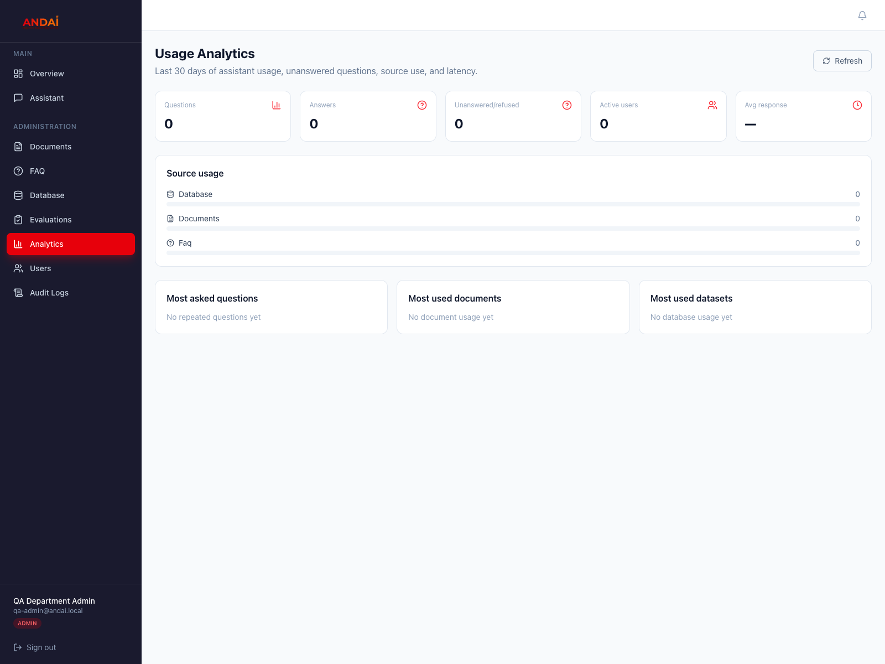

*Screenshot 9: Usage Analytics page.*

## 9. Organization Admin - Users and Audit Logs

### Create or update a user

1. Open Users.
2. Click Add User to create an account in your organization.
3. Enter the user's name, email, temporary password, and role.
4. Assign General or the departments the user is allowed to access.
5. Use Department Access later when the user's responsibilities change.

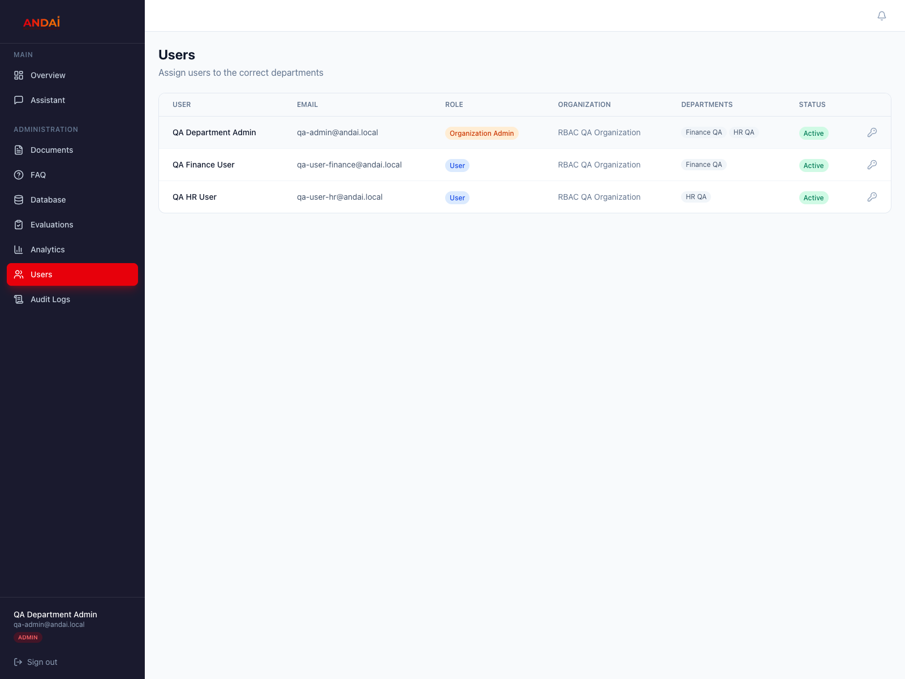

*Screenshot 10: Organization Admin Users page.*

### Review audit activity

- Open Audit Logs to review logins, uploads, user changes, and other important actions.
- Use the displayed user and organization names to understand who performed each action.
- Record the time and details before escalating unusual activity to the Full Admin.

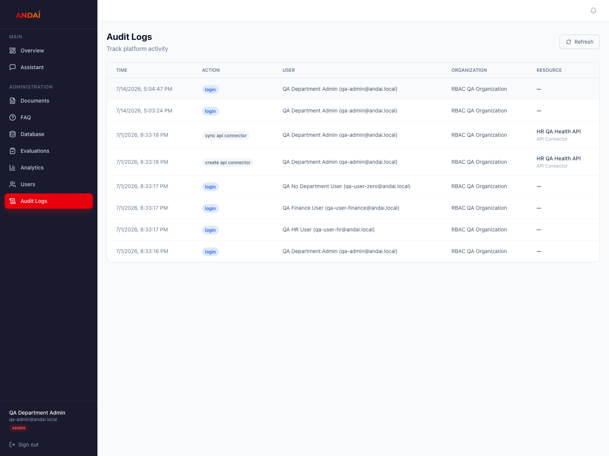

*Screenshot 11: Organization Admin Audit Logs page.*

## 10. Full Admin - Platform Setup

Full Admins manage platform structure and access. Their sidebar intentionally excludes daily Assistant and knowledge-maintenance pages.

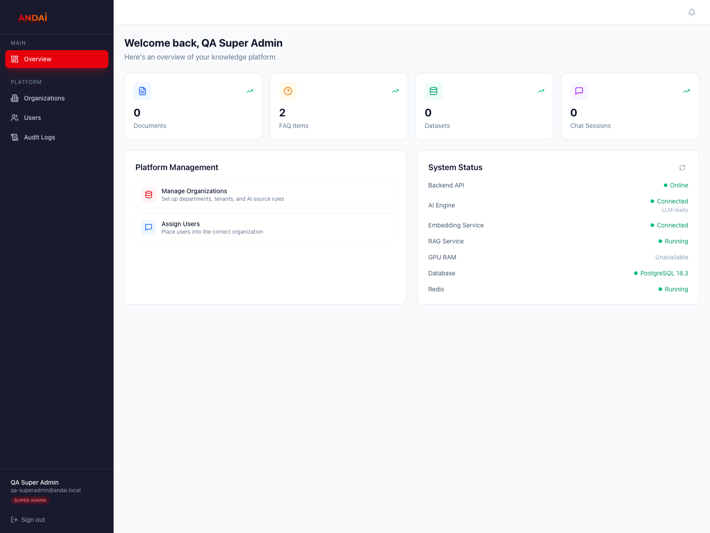

*Screenshot 12: Full Admin overview.*

### Create an organization and departments

1. Open Organizations and click Add Organization.
2. Enter the organization name and description.
3. Create the organization; ANDAI adds a General department automatically.
4. Open Manage Departments to add units such as HR, Finance, Operations, or Credit.
5. Keep departments separate when their knowledge must not be shared.

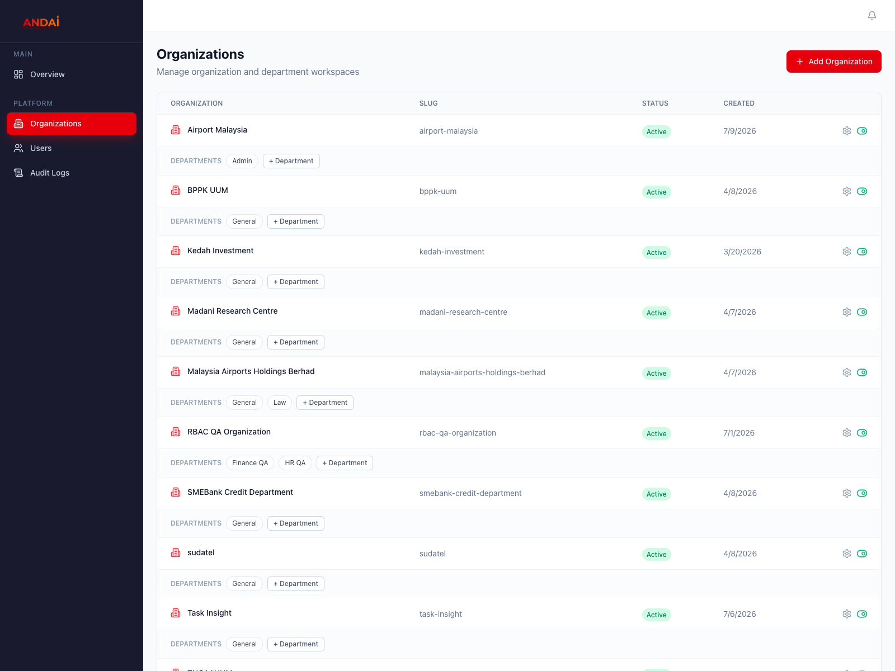

*Screenshot 13: Organizations and department controls.*

### Create users and assign roles

1. Open Users and click Add User.
2. Enter the person's name, email, temporary password, role, and organization.
3. Assign department access for Organization Admins and Normal Users.
4. Create the account and verify its role in the user list.
5. Give the temporary password to the user through a separate secure channel.

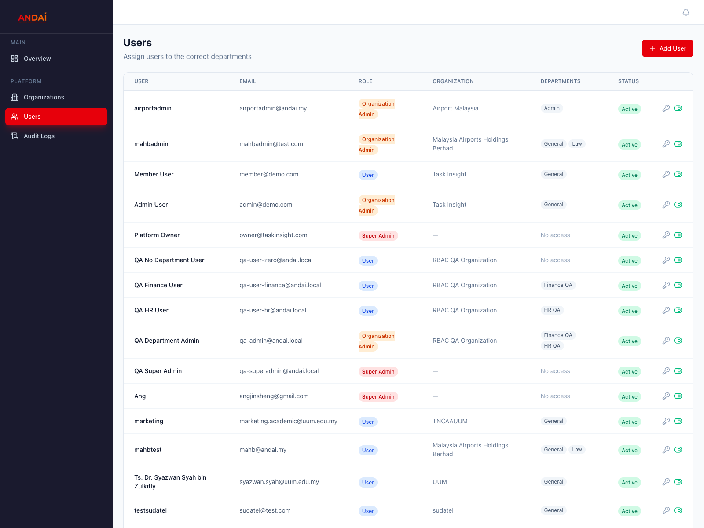

*Screenshot 14: Full Admin Users page.*

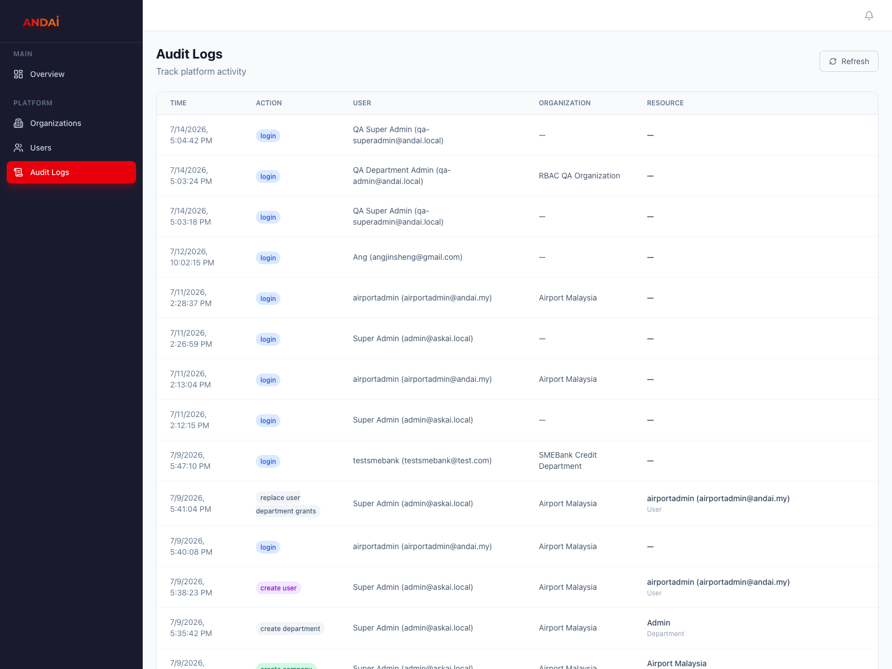

*Screenshot 15: Full Admin Audit Logs across organizations.*

## 11. Troubleshooting

| Problem | Likely cause | What to do |
| --- | --- | --- |
| I only see Assistant. | The account is a Normal User. | This is expected. Ask an admin if the role is wrong. |
| I can chat but get no organization evidence. | No department access or no matching knowledge. | Ask an admin to assign a department and confirm that knowledge is Ready or published. |
| ANDAI cannot find the answer. | The question is broad or the selected sources contain no match. | Ask more specifically, select the relevant sources, or add the missing knowledge. |
| A document stays in Processing or Error. | The file is scanned, unreadable, or processing failed. | Use OCR for scanned files, retry processing, or upload a text-readable PDF or DOCX. |
| Upload or Save appears to do nothing. | A required field, file, or department is missing. | Check every required field and confirm a department is selected. |
| A database answer looks wrong. | The table is outdated or owned by the wrong department. | Use View data, confirm the rows and department, then re-import if needed. |
| A page is missing. | The role does not include that page. | Ask an administrator to check the user's role and organization. |

**Information to include in a support request:** Provide your email, role, organization, department, page name, what you clicked, the exact question or filename, and the time the problem occurred. Never send your password or access token.

## 12. Suggested Training Session

### 45-minute training flow

1. 5 minutes: explain roles, organizations, and department access.
2. 10 minutes: Normal User starts a chat, selects sources, and checks citations.
3. 10 minutes: Organization Admin uploads one document and creates one FAQ item.
4. 8 minutes: Organization Admin imports a small CSV and confirms its rows.
5. 7 minutes: Full Admin shows organization, department, and user setup.
6. 5 minutes: review troubleshooting and the support process.

### Trainer preparation

- Use non-sensitive demo data and one test account for each role.
- Prepare one readable PDF or DOCX, one approved FAQ, and one small CSV.
- Confirm the Organization Admin has department access before training.
- Confirm the document is Ready before asking questions about it.
- Share temporary passwords separately; never place them in training materials.

## Appendix A. API Testing for Technical Users

Authorized technical users can ask ANDAI directly through the authenticated API. This is separate from the standard web controls and follows the same user, organization, and department permissions.

### Basic API test

1. Request an access token from POST /api/auth/login using your assigned email and password.
2. Copy only the access_token value from the response.
3. Send a JSON question to POST /api/chat with the token in the Authorization header.
4. Check the answer and sources in the JSON response.

```bash
curl -X POST https://andai.my/api/auth/login \
  -H "Content-Type: application/x-www-form-urlencoded" \
  --data-urlencode "username=YOUR_EMAIL" \
  --data-urlencode "password=YOUR_PASSWORD"
```

```bash
curl -X POST https://andai.my/api/chat \
  -H "Authorization: Bearer YOUR_ACCESS_TOKEN" \
  -H "Content-Type: application/json" \
  -d '{"message":"What is the approved procedure?","sources":["documents","faq"],"ai_insights":false}'
```

| Response | Meaning | Action |
| --- | --- | --- |
| 200 | The request was accepted. | Read message and sources in the JSON response. |
| 401 | The token is missing, invalid, or expired. | Sign in again and use the new access token. |
| 403 | The account cannot access the requested organization or department. | Ask an admin to check the account assignment. |
| No evidence | Approved sources did not contain a match. | Ask more specifically or improve the approved knowledge. |

**Protect credentials:** Do not paste passwords or access tokens into tickets, screenshots, documents, or chat messages. Use a test account and non-sensitive questions during demonstrations.
